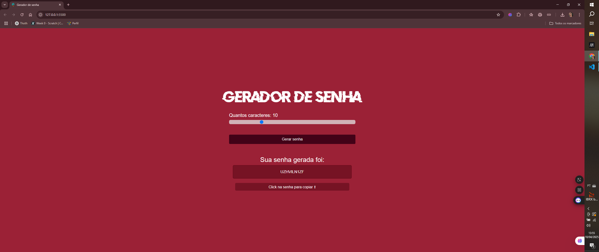

# 🔐 Gerador de Senha

Este é um projeto simples e funcional de **gerador de senhas** aleatórias, desenvolvido com HTML, CSS e JavaScript. Ele permite ao usuário escolher a quantidade de caracteres desejada para a senha e gera uma combinação segura com letras maiúsculas, minúsculas, números e símbolos (dependendo de como você configurar no código, claro).

## 🚀 Funcionalidades

- Escolher o número de caracteres via um slider.
- Gerar senhas aleatórias com um clique.
- Copiar a senha gerada para a área de transferência com apenas um clique.
- Interface simples e estilosa (com aquele toque pessoal 💅).

## 💻 Tecnologias Utilizadas

- **HTML5** – Estrutura básica da página.
- **CSS3** – Estilização da interface, com foco em um visual marcante e acessível.
- **JavaScript (puro/vanilla)** – Responsável pela lógica de geração de senha e interações com o DOM.

## 🖼️ Visual do Projeto

Veja abaixo uma prévia do visual da aplicação:

